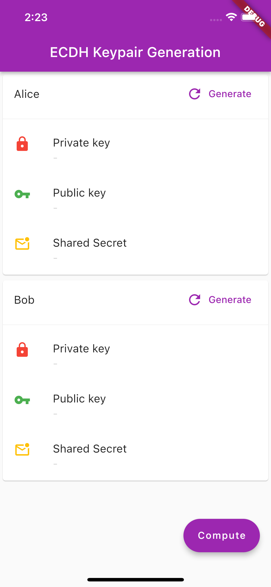

# flutter_micro_ecc

micro-ecc plugin for Flutter.

# Alpha version
This library is actively developed alongside production apps, and the API will evolve as we continue our way to version 1.0.

Please be fully prepared to deal with breaking changes. This package must be tested on a real device.

Need a API which is currently unavailable? Please raise a issue. PRs are also appreciated.


---

> Android NDK is needed for using this library on Android.

---

# Features

## Curves
- SECP160R1
- SECP192R1
- SECP224R1
- SECP256R1
- SECP256K1

## Operations
- Generate Key Pair
- Compute shared secret

# Usage

## Selecting a curve

```
final curve = EcdhCurve.SECP256R1;
```

## Generating a KeyPair

```
final Ecdh ecdh = Ecdh();
EcdhKeyPair _alice = _ecdh.generateKeyPair(_curve);
```


## Computing the shared secret

```
final Ecdh ecdh = Ecdh();
Uint8List _aliceSharedSecret = _ecdh.computeSharedSecret(_alice.privateKey, _bob.publicKey, _curve);
```

# Example Application


Generate a keypair by clicking on the `Generate` button.




- Compute the shared secret by clicking on the `Compute` button.


- The &#9989; indicates the shared secret on both the nodes is equal.


# Notes
I developed this library because I could not find any decent clean solution to facilitate the ECDH key exchange. The functionality may still be limited though. Please feel free to contribute to this library, in case you find any functionality is missing.
